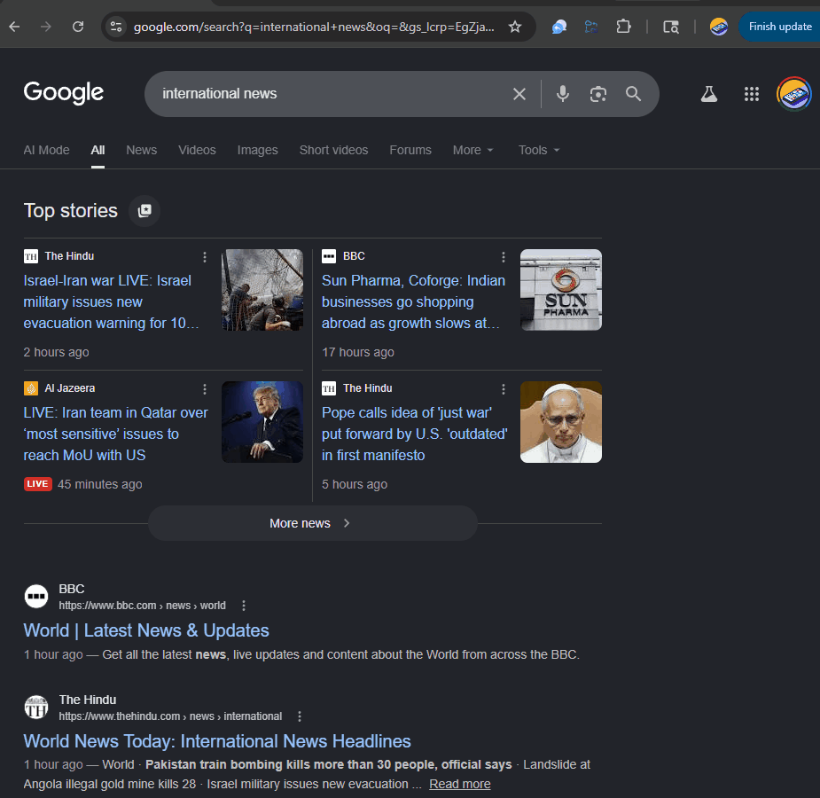

# 📋 NotebookLM Web Clipper

> **Any web page in. Structured NotebookLM note out.**
> Clip any article, doc, or blog post to NotebookLM with a Gemini-generated smart note — summary, key points, and tags — in under 20 seconds.

---

## 📖 The Problem & The Solution

**NotebookLM is one of the best research tools ever built — but getting content into it is painful.**

The manual flow: copy all the page text → open NotebookLM → click Add Source → select Paste Text → paste → write a title → realise you forgot the URL → go back → find it → paste that too. Five steps, no structure, every single time.

**NotebookLM Web Clipper collapses that to one click.** Open any article, click the extension, and Gemini produces a structured note with a summary, key points, and tags — formatted exactly for NotebookLM's text source input. Copy it, open NotebookLM, paste. Under 20 seconds.

---

## ⚡ Core Features

- ✂️ **One-Click Clip** — Gemini reads the current page and writes a complete, structured note automatically.
- 🗂️ **Smart Note Format** — Every clip includes: title, source URL, date, 3–5 sentence summary, key points, and topic tags.
- 📋 **Copy to Clipboard** — One click copies the full markdown note, ready to paste directly into NotebookLM as a text source.
- 📖 **Open NotebookLM Button** — Jumps straight to notebooklm.google.com from the result view.
- 🪟 **Page Card Preview** — The idle state shows the current tab's domain and title so you always know what you're about to clip.
- 💾 **URL-Keyed Session Cache** — Reopen the popup on the same page within 10 minutes and the note loads instantly — no re-processing.
- 🔌 **Automatic Fallback** — Add both Gemini and OpenRouter keys. Defaults to Gemini, falls back to OpenRouter on quota exhaustion.

---

## 🛠 Getting Started

### 1. Load the Extension
1. Clone this repository locally.
2. Open Chrome and navigate to `chrome://extensions`.
3. Toggle on **Developer mode** in the top right.
4. Click **Load unpacked** and select the `notebooklm-web-clipper` folder.

### 2. Configure Your Keys
On first launch, the extension shows an onboarding screen:
- **Gemini Key** — Get one free at [aistudio.google.com](https://aistudio.google.com/app/apikey).
- **OpenRouter Key** — Get one at [openrouter.ai](https://openrouter.ai) *(optional fallback)*.

*To update your keys later, click the **⚙** gear icon in the popup header.*

### 3. Clip Your First Page
1. Navigate to any article, blog post, or documentation page.
2. Click the **NotebookLM Clipper** icon in your toolbar.
3. Click **✂ Generate Clip** — Gemini reads the page and writes the note.
4. Click **📋** to copy, then **📖 Open NotebookLM**.
5. In NotebookLM: **Add source → Paste text** → paste → done.

---

## 🧠 Engineering Highlight: Silent Fallback Extraction

The first challenge: content scripts don't always inject before the popup opens — especially on freshly navigated tabs. Early versions showed a "Could not read page content" error that required the user to reload the page, which killed the one-click experience.

The fix was a two-layer extraction strategy:

1. **Primary path** — message the already-injected content script (`extractContent` action), which strips nav/footer/ads and returns cleaned text.
2. **Silent fallback** — if the message fails (content script not ready), the extension immediately switches to `chrome.scripting.executeScript`, injecting the extraction function directly. No error shown, no reload required.

The result: the clip works on every tab, including ones opened one second ago.

> [!NOTE]
> The session cache is keyed by tab URL — not just timestamp. Reopening the popup on a different page correctly shows the idle state instead of the previous page's note.

---

## 🔧 Technical Stack

- **Extension Framework**: Chrome Extension Manifest V3
- **Primary AI Model**: Gemini 2.0 Flash via Gemini API
- **Fallback Engine**: OpenRouter API (multi-model cascade)
- **Page Extraction**: Content script + `chrome.scripting.executeScript` fallback
- **Caching**: `chrome.storage.session` with URL-keyed TTL (10 min)
- **Client Implementation**: Pure Vanilla JS — zero build steps, zero dependencies

---

## 📅 180 Days of Building

This project is part of a larger developer journey: shipping one useful AI tool every day for 180 days.

This release is part of the **Google I/O 2026 Sprint — 7 Project Series** (`IO-4`), powered by **Gemini 2.0 Flash**.

Follow along for daily releases and tech-stack deep dives:
- **Twitter / X**: [@happy_ships](https://x.com/happy_ships)
- **Day**: `11 / 180`

---

*Licensed under the [MIT License](LICENSE).*
